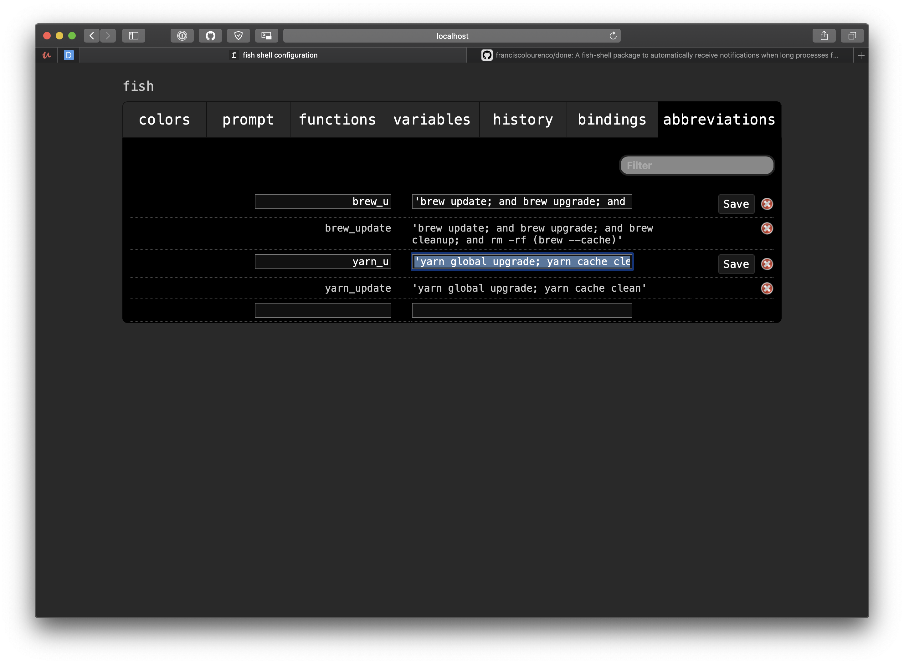

# Personnal Config

<strong>Personal config on my mac!</strong>

* [font powerline](https://github.com/powerline/fonts)
* [font firacode](https://github.com/tonsky/FiraCode)

```sh
curl -sSL https://raw.githubusercontent.com/fusengine/mac-conf/master/install.sh | sh
```

# fish

```sh
fish_config

'brew update; and brew upgrade; and brew cleanup; and rm -rf (brew --cache)'
'yarn global upgrade; yarn cache clean'
```

## install fisher theme and plugin

```sh
fisher add fishpkg/fish-prompt-metro
fisher add franciscolourenco/done
fisher
fisher self-update

```
if you have bug run this on your terminal
```sh
curl -Lo ~/.config/fish/functions/humanize_duration.fish --create-dirs https://raw.githubusercontent.com/fishpkg/fish-humanize-duration/master/humanize_duration.fish
curl -Lo ~/.config/fish/conf.d/done.fish --create-dirs https://raw.githubusercontent.com/franciscolourenco/done/master/conf.d/done.fish
```
